# AlphaFold 2 Pipeline Diagrams

Visual guide to understanding how AlphaFold 2 predicts protein structures.

---

## 📚 Key Terms

| Term | Definition |
|------|------------|
| **Amino Acid** | Building block of proteins (20 types: A, C, D, E, F, G, H, I, K, L, M, N, P, Q, R, S, T, V, W, Y) |
| **Residue** | Amino acid in a protein chain (after losing H₂O during peptide bond formation) |
| **Sequence** | Order of amino acids: `MKFLKFS...` |
| **MSA** | Multiple Sequence Alignment - similar sequences from evolution |
| **pLDDT** | Confidence score (0-100) per residue. >90 = very reliable |
| **PAE** | Predicted Aligned Error - uncertainty between residue pairs |
| **PDB** | File format for 3D protein structures |
| **Template** | Known structure used as reference |
| **Domain** | Distinct structural/functional region within a protein |

---

## 1. Pipeline Overview

## 2. Confidence Scores (pLDDT)

```mermaid
graph LR
    subgraph Scale ["Confidence Spectrum (pLDDT)"]
        direction LR
        A[0] --- B["🔴 Low / Disordered<br/>(< 50)"]
        B --- C["🟠 Low Confidence<br/>(50 - 70)"]
        C --- D["🟡 Good<br/>(70 - 90)"]
        D --- E["🟢 Very High<br/>(> 90)"]
        E --- F[100]
    end

    style B fill:#ffcdd2,stroke:#b71c1c
    style C fill:#ffe0b2,stroke:#e65100
    style D fill:#fff9c4,stroke:#fbc02d
    style E fill:#c8e6c9,stroke:#1b5e20
```

## 3. PAE Matrix Interpretation

```mermaid
graph TD
    subgraph Matrix ["PAE Matrix (Predicted Aligned Error)"]
        A["Blue Region 🟦"] -->|Indicates| B["Rigid Relative Position<br/>(Fixed Domain)"]
        C["Red/Yellow Region 🟥"] -->|Indicates| D["Uncertain Relative Position<br/>(Flexible / Separate Domains)"]
    end
    
    subgraph Decision ["Analysis"]
        B --> E[Trust the domain structure]
        D --> F[Do not interpret relative orientation]
    end

    style A fill:#bbdefb,stroke:#0d47a1
    style C fill:#ffccbc,stroke:#bf360c
```

## 4. AlphaFold 2 Architecture

## 5. AlphaFold 3 Architecture (Unified)

## 6. Comparison: AF2 vs AF3

## 7. Decision Guide: When to Trust?

---

## Additional Resources

### Interactive Notebooks in This Repository
- **`alphafold2.ipynb`** - Complete AlphaFold 2 workflow with ColabFold
- **`alphafold3.ipynb`** - AlphaFold 3 preparation and analysis

### Online Resources
- **Try it online:** [ColabFold AlphaFold2 Notebook](https://colab.research.google.com/github/sokrypton/ColabFold/blob/main/AlphaFold2.ipynb)
- **AlphaFold Server:** [alphafoldserver.com](https://alphafoldserver.com) (for AlphaFold 3)
- **AlphaFold Database:** [alphafold.ebi.ac.uk](https://alphafold.ebi.ac.uk/) - Pre-computed structures
- **Original Paper:** [Jumper et al., Nature 2021](https://www.nature.com/articles/s41586-021-03819-2)
- **AlphaFold 3 Paper:** [Abramson et al., Nature 2024](https://www.nature.com/articles/s41586-024-07487-w)
- **DeepMind Blog:** [AlphaFold announcements](https://www.deepmind.com/research/highlighted-research/alphafold)
- **Visualization:** PyMOL, ChimeraX, py3Dmol, or Mol* viewers
