# AlphaFold 2 Pipeline Diagrams

Visual guide to understanding how AlphaFold 2 predicts protein structures.

---

## 📚 Key Terms Explained

**Amino Acid** - Building block of proteins (like beads on a string). There are 20 types, each represented by a letter (A, C, D, E, F, G, H, I, K, L, M, N, P, Q, R, S, T, V, W, Y).

**Residue** - An amino acid when it's part of a protein chain. When amino acids link together via peptide bonds, they lose a water molecule (H₂O) and what remains is called a "residue" (from "residuum" = what's left over). If a protein has 100 amino acids, it has 100 residues. Used for numbering: "residue 25" means the 25th amino acid position.

**Sequence** - The order of amino acids in a protein, written as a string of letters (e.g., "MKFLKFS...").

**MSA (Multiple Sequence Alignment)** - A collection of similar protein sequences from different organisms, aligned to show which positions are conserved across evolution.

**pLDDT (predicted Local Distance Difference Test)** - A confidence score (0-100) for each residue. Higher = more confident prediction. >90 is very reliable.

**PAE (Predicted Aligned Error)** - Shows uncertainty in the relative positions between pairs of residues. Helps identify well-defined vs. uncertain regions.

**PDB (Protein Data Bank)** - Standard file format for storing 3D protein structures with atomic coordinates.

**Template** - A known protein structure that's similar to your target, used as a reference.

**Domain** - A distinct structural/functional region within a protein. Like chapters in a book.

---

## 1. Pipeline Overview

```mermaid
flowchart TD
    A[Input Sequence<br/>e.g., MKFLKFSLLT...] --> B[Search for Similar Sequences<br/>MSA + Templates]
    B --> C[Prepare Features<br/>Convert to numbers]
    C --> D[Neural Network<br/>Evoformer]
    D --> E[Structure Module<br/>Predict 3D coordinates]
    E --> F{Recycle?<br/>Refine prediction}
    F -->|Yes, repeat 3x| D
    F -->|Done| G[Output Files]
    G --> H[📄 PDB Structure<br/>3D coordinates]
    G --> I[📊 pLDDT Scores<br/>Per-residue confidence]
    G --> J[📈 PAE Matrix<br/>Position uncertainty]
    
    style A fill:#e3f2fd
    style H fill:#c8e6c9
    style I fill:#c8e6c9
    style J fill:#c8e6c9
    style D fill:#fff9c4
    style E fill:#fff9c4
```



**What this shows:** The complete flow from input sequence to final 3D structure with confidence scores.

---

## 2. Confidence Scores (pLDDT)

```mermaid
flowchart LR
    A[pLDDT Score] --> B{Score Range?}
    B -->|90-100| C[✅ Very High<br/>Trust completely]
    B -->|70-89| D[✅ Good<br/>Generally reliable]
    B -->|50-69| E[⚠️ Low<br/>Use with caution]
    B -->|0-49| F[❌ Very Low<br/>Likely disordered]
    
    style C fill:#4caf50,color:#fff
    style D fill:#8bc34a
    style E fill:#ff9800
    style F fill:#f44336,color:#fff
```



**Color Guide for Visualization:**
- 🟢 Green (>90): High confidence
- 🟡 Yellow (70-90): Good confidence  
- 🟠 Orange (50-70): Low confidence
- 🔴 Red (<50): Very unreliable

**Example interpretation:**
```
Residue:   M  K  F  L  K  F  S  L  L  T
Position:  1  2  3  4  5  6  7  8  9  10
pLDDT:    45 68 75 88 92 95 94 96 91 89
Status:   🔴 ⚠️ 🟡 🟡 🟢 🟢 🟢 🟢 🟢 🟡
```

---

## 3. PAE Matrix Patterns

### Single Well-Defined Domain


**Interpretation:** When the entire PAE matrix is blue (low error), the protein folds into one well-defined structure.

### Multiple Domains


**Interpretation:** Blue squares along the diagonal = confident domains. Orange/red elsewhere = uncertain how domains connect.

---

## 4. AlphaFold Architecture


**Key Components (AlphaFold 2 Architecture):**
- **Evoformer (48 blocks):** Processes evolutionary information and learns which residues interact
- **Structure Module (8 layers):** Converts those relationships into actual 3D coordinates using Invariant Point Attention (IPA)
- **Recycling (3 iterations):** Feeds predictions back to refine them (like drafting and editing)

---

## 5. MSA (Multiple Sequence Alignment)


**Why MSA matters:**
If two positions in a protein always change together across evolution (co-evolution), they're likely close in 3D space. AlphaFold uses this signal.

**Example:**
```
Your protein:    M K F L K F S L L T
Similar (bacteria):  M K F L K F - L L T  (gap at position 7)
Similar (yeast):     M K Y L K F S L L T  (Y instead of F)
Similar (plant):     M K F L R F S L L T  (R instead of K)

→ Positions 1, 2, 6, 8, 9, 10 are highly conserved (important!)
```

---

## 6. Data Flow & Dimensions

```mermaid
flowchart TD
    A[Input Sequence<br/>100 residues] --> B[MSA Features<br/>512 sequences × 100 positions]
    A --> C[Pair Features<br/>100 × 100 grid]
    
    B --> D[Evoformer Processing]
    C --> D
    
    D --> E[Structure Module]
    E --> F[Output Coordinates<br/>100 residues × 37 atoms × 3D]
    E --> G[pLDDT Scores<br/>100 values]
    E --> H[PAE Matrix<br/>100 × 100]
    
    style A fill:#e3f2fd
    style F fill:#c8e6c9
    style G fill:#c8e6c9
    style H fill:#c8e6c9
```



**Simplified:** 
1. Start with a sequence (1D list of letters)
2. Add evolutionary context (2D alignment)
3. Learn residue relationships (2D grid)
4. Output 3D structure with confidence scores

---

## 7. Confidence Decision Tree

```mermaid
flowchart TD
    A[Got AlphaFold Prediction] --> B{Check pLDDT}
    B -->|Most residues >90| C{Check PAE}
    B -->|Many <70| D[⚠️ Low Confidence Region<br/>Possibly disordered]
    
    C -->|Blue blocks| E[✅ Excellent Prediction<br/>Use with confidence]
    C -->|Orange/Red| F[⚠️ Domain Arrangement Uncertain<br/>Individual domains may be OK]
    
    D --> G[Consider:<br/>- Insufficient MSA<br/>- Disordered region<br/>- Novel fold]
    
    style E fill:#4caf50,color:#fff
    style F fill:#ff9800
    style D fill:#f44336,color:#fff
```



---

## 8. Workflow Summary

```mermaid
flowchart LR
    A[1️⃣ Prepare<br/>FASTA file] --> B[2️⃣ Run<br/>ColabFold/AlphaFold]
    B --> C[3️⃣ Check<br/>pLDDT scores]
    C --> D[4️⃣ Inspect<br/>PAE matrix]
    D --> E[5️⃣ Visualize<br/>3D structure]
    E --> F[6️⃣ Validate<br/>against experiments]
    
    style A fill:#e3f2fd
    style C fill:#fff9c4
    style D fill:#fff9c4
    style E fill:#c8e6c9
    style F fill:#c8e6c9
```



---

## 9. Common Use Cases


---

## Quick Reference

### When to Trust Predictions
✅ **Trust:**
- pLDDT > 90 throughout
- Blue PAE matrix
- Deep MSA (>100 sequences)

⚠️ **Be Cautious:**
- pLDDT 70-90
- Yellow/orange PAE patterns
- Multi-domain proteins

❌ **Don't Trust:**
- pLDDT < 50
- Red PAE matrix
- Very short sequences (<30 residues)

### File Outputs
- `ranked_0.pdb` - Best structure (3D coordinates)
- `*_plddt.png` - Confidence per residue
- `*_pae.png` - Position uncertainty heatmap
- `ranking_debug.json` - Detailed scores

---

## Additional Resources

- **Try it online:** [ColabFold AlphaFold2 Notebook](https://colab.research.google.com/github/sokrypton/ColabFold/blob/main/AlphaFold2.ipynb)
- **AlphaFold 2 Database:** Pre-computed structures for millions of proteins
- **Original Paper:** [Jumper et al., Nature 2021](https://www.nature.com/articles/s41586-021-03819-2)
- **DeepMind Blog:** [AlphaFold 2 announcement](https://www.deepmind.com/research/highlighted-research/alphafold)
- **Visualization:** PyMOL, ChimeraX, or online viewers
