# AlphaFold 2 Pipeline Diagrams

Visual guide to understanding how AlphaFold 2 predicts protein structures.

---

## 📚 Key Terms

| Term | Definition |
|------|------------|
| **Amino Acid** | Building block of proteins (20 types: A, C, D, E, F, G, H, I, K, L, M, N, P, Q, R, S, T, V, W, Y) |
| **Residue** | Amino acid in a protein chain (after losing H₂O during peptide bond formation) |
| **Sequence** | Order of amino acids: `MKFLKFS...` |
| **MSA** | Multiple Sequence Alignment - similar sequences from evolution |
| **pLDDT** | Confidence score (0-100) per residue. >90 = very reliable |
| **PAE** | Predicted Aligned Error - uncertainty between residue pairs |
| **PDB** | File format for 3D protein structures |
| **Template** | Known structure used as reference |
| **Domain** | Distinct structural/functional region within a protein |

---

## 1. Pipeline Overview

```mermaid
flowchart TD
    A[Input Sequence<br/>e.g., MKFLKFSLLT...] --> B[Search for Similar Sequences<br/>MSA + Templates]
    B --> C[Prepare Features<br/>Convert to numbers]
    C --> D[Neural Network<br/>Evoformer]
    D --> E[Structure Module<br/>Predict 3D coordinates]
    E --> F{Recycle?<br/>Refine prediction}
    F -->|Yes, repeat 3x| D
    F -->|Done| G[Output Files]
    G --> H[📄 PDB Structure<br/>3D coordinates]
    G --> I[📊 pLDDT Scores<br/>Per-residue confidence]
    G --> J[📈 PAE Matrix<br/>Position uncertainty]
    
    style A fill:#e3f2fd
    style H fill:#c8e6c9
    style I fill:#c8e6c9
    style J fill:#c8e6c9
    style D fill:#fff9c4
    style E fill:#fff9c4
```

---

## 2. Confidence Scores (pLDDT)

```mermaid
flowchart LR
    A[pLDDT Score] --> B{Score Range?}
    B -->|90-100| C[✅ Very High<br/>Trust completely]
    B -->|70-89| D[✅ Good<br/>Generally reliable]
    B -->|50-69| E[⚠️ Low<br/>Use with caution]
    B -->|0-49| F[❌ Very Low<br/>Likely disordered]
    
    style C fill:#4caf50,color:#fff
    style D fill:#8bc34a
    style E fill:#ff9800
    style F fill:#f44336,color:#fff
```

**Color Guide:** 🟢 >90 (High) | 🟡 70-90 (Good) | 🟠 50-70 (Low) | 🔴 <50 (Unreliable)

---

## 3. PAE Matrix Patterns

### Single Well-Defined Domain

### Multiple Domains

---

## 4. AlphaFold Architecture

---

## 5. MSA (Multiple Sequence Alignment)

**Key insight:** Co-evolving positions are likely close in 3D space.

---

## 6. Data Flow & Dimensions

```mermaid
flowchart TD
    A[Input Sequence<br/>100 residues] --> B[MSA Features<br/>512 sequences × 100 positions]
    A --> C[Pair Features<br/>100 × 100 grid]
    
    B --> D[Evoformer Processing]
    C --> D
    
    D --> E[Structure Module]
    E --> F[Output Coordinates<br/>100 residues × 37 atoms × 3D]
    E --> G[pLDDT Scores<br/>100 values]
    E --> H[PAE Matrix<br/>100 × 100]
    
    style A fill:#e3f2fd
    style F fill:#c8e6c9
    style G fill:#c8e6c9
    style H fill:#c8e6c9
```

---

## 7. Confidence Decision Tree

```mermaid
flowchart TD
    A[Got AlphaFold Prediction] --> B{Check pLDDT}
    B -->|Most residues >90| C{Check PAE}
    B -->|Many <70| D[⚠️ Low Confidence Region<br/>Possibly disordered]
    
    C -->|Blue blocks| E[✅ Excellent Prediction<br/>Use with confidence]
    C -->|Orange/Red| F[⚠️ Domain Arrangement Uncertain<br/>Individual domains may be OK]
    
    D --> G[Consider:<br/>- Insufficient MSA<br/>- Disordered region<br/>- Novel fold]
    
    style E fill:#4caf50,color:#fff
    style F fill:#ff9800
    style D fill:#f44336,color:#fff
```

---

## 8. Workflow Summary

```mermaid
flowchart LR
    A[1️⃣ Prepare<br/>FASTA file] --> B[2️⃣ Run<br/>ColabFold/AlphaFold]
    B --> C[3️⃣ Check<br/>pLDDT scores]
    C --> D[4️⃣ Inspect<br/>PAE matrix]
    D --> E[5️⃣ Visualize<br/>3D structure]
    E --> F[6️⃣ Validate<br/>against experiments]
    
    style A fill:#e3f2fd
    style C fill:#fff9c4
    style D fill:#fff9c4
    style E fill:#c8e6c9
    style F fill:#c8e6c9
```

---

## 9. Common Use Cases

---

## 10. AlphaFold 3 Architecture (2024)

**Key Changes from AlphaFold 2:**
- **Pairformer:** More efficient than Evoformer, handles mixed biomolecules
- **Diffusion Model:** Generates structures by denoising (like image generation AI)
- **Unified Representation:** Single model for proteins, nucleic acids, and small molecules

---

## 11. AlphaFold 2 vs 3 Comparison

| Feature | AlphaFold 2 | AlphaFold 3 |
|---------|-------------|-------------|
| **Architecture** | Evoformer + IPA | Pairformer + Diffusion |
| **Proteins** | ✅ Excellent | ✅ Enhanced |
| **DNA/RNA** | ❌ No | ✅ Yes |
| **Ligands** | ❌ No | ✅ Yes |
| **Local Install** | ✅ Yes | ❌ Web only |
| **Use Case** | Protein structures | Biomolecular complexes |

---

## 12. AlphaFold 3 Use Cases

```mermaid
flowchart TD
    A[AlphaFold 3<br/>Applications] --> B[Drug Discovery<br/>💊]
    A --> C[Gene Regulation<br/>🧬]
    A --> D[CRISPR Design<br/>✂️]
    A --> E[Enzyme Engineering<br/>⚗️]
    
    B --> B1[Ligand binding sites]
    B --> B2[Drug-protein complexes]
    
    C --> C1[Transcription factors]
    C --> C2[DNA-protein interactions]
    
    D --> D1[Cas9-RNA structures]
    D --> D2[Guide RNA design]
    
    E --> E1[Cofactor binding]
    E --> E2[Metal coordination]
    
    style A fill:#e3f2fd
    style B fill:#c8e6c9
    style C fill:#c8e6c9
    style D fill:#c8e6c9
    style E fill:#c8e6c9
```

---

## Quick Reference

### When to Trust Predictions
✅ **Trust:**
- pLDDT > 90 throughout
- Blue PAE matrix
- Deep MSA (>100 sequences)

⚠️ **Be Cautious:**
- pLDDT 70-90
- Yellow/orange PAE patterns
- Multi-domain proteins

❌ **Don't Trust:**
- pLDDT < 50
- Red PAE matrix
- Very short sequences (<30 residues)

### File Outputs
- `ranked_0.pdb` - Best structure (3D coordinates)
- `*_plddt.png` - Confidence per residue
- `*_pae.png` - Position uncertainty heatmap
- `ranking_debug.json` - Detailed scores

---

## Additional Resources

### Interactive Notebooks in This Repository
- **`alphafold2.ipynb`** - Complete AlphaFold 2 workflow with ColabFold
- **`alphafold3.ipynb`** - AlphaFold 3 preparation and analysis

### Online Resources
- **Try it online:** [ColabFold AlphaFold2 Notebook](https://colab.research.google.com/github/sokrypton/ColabFold/blob/main/AlphaFold2.ipynb)
- **AlphaFold Server:** [alphafoldserver.com](https://alphafoldserver.com) (for AlphaFold 3)
- **AlphaFold Database:** [alphafold.ebi.ac.uk](https://alphafold.ebi.ac.uk/) - Pre-computed structures
- **Original Paper:** [Jumper et al., Nature 2021](https://www.nature.com/articles/s41586-021-03819-2)
- **AlphaFold 3 Paper:** [Abramson et al., Nature 2024](https://www.nature.com/articles/s41586-024-07487-w)
- **DeepMind Blog:** [AlphaFold announcements](https://www.deepmind.com/research/highlighted-research/alphafold)
- **Visualization:** PyMOL, ChimeraX, py3Dmol, or Mol* viewers
